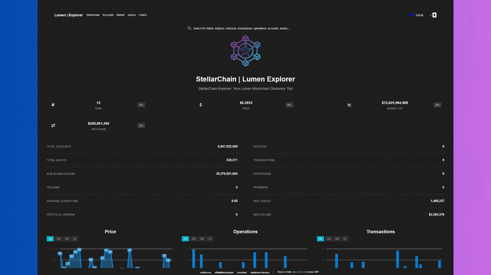

# Dojo Stellar - Lumen League Team ✨

  

---

## 📌 Table of Contents

1. [About Dojo Stellar](#about-dojo-stellar)
2. [Objectives and Learning](#objectives-and-learning)
3. [Participants](#participants)
4. [Weekly Challenges](#weekly-challenges)
   - [Week 1: Blockchain Explorer](#week-1-blockchain-explorer)
   - [Week 2: CLI Wallet](#week-2-cli-wallet)
   - [Week 3: Blockchain Oracle](#week-3-blockchain-oracle)
   - [Week 4: Decentralized Exchange (DEX)](#week-4-decentralized-exchange-dex)
5. [Schedule](#schedule)
6. [License](#license)

---

## 🚀 About Dojo Stellar

**Dojo Stellar** is a hands-on immersion organized by **NearX** (<a href="https://app.nearx.com.br" target="_blank">app.nearx.com.br</a>) for developers who want to master the Stellar ecosystem and prepare for emerging opportunities in **Web3**.

The dojo’s goal is to provide a dynamic and collaborative environment where participants learn **by doing** how to develop decentralized applications using the Stellar blockchain. Throughout the event, weekly challenges will allow developers to deepen their technical knowledge, enhance their portfolios, and stand out in the blockchain and decentralized finance (**DeFi**) market.

---

## 🎯 Objectives and Learning

**Dojo Stellar** empowers participants to:

- **Understand the Stellar ecosystem** and its real-world applications.
- **Explore opportunities in Web3** and new business possibilities for 2025.
- **Work with Stellar code updates** and actively contribute to the ecosystem.
- **Develop practical projects** that can enhance a professional portfolio.

The event is designed for both novice developers and those with blockchain experience who wish to expand their knowledge in Stellar.

---

## 👥 Participants

The **Lumen League** team is composed of the following members:

  <table>
    <tr>
      <td align="center">
        <a href="https://github.com/robdicoco">
           
          <b>robdicoco</b>
        </a>
      </td>
      <td align="center">
        <a href="https://github.com/alfatektecnologia">
           
          <b>alfatektecnologia</b>
        </a>
      </td>
      <td align="center">
        <a href="https://github.com/lucenfort">
           
          <b>lucenfort</b>
        </a>
      </td>
      <td align="center">
        <a href="https://github.com/uederson-ferreira">
           
          <b>uederson-ferreira</b>
        </a>
      </td>
    </tr>
  </table>

---

## 🏆 Weekly Challenges

**Dojo Stellar** is structured into four progressive challenges, each focusing on developing solutions for the Stellar network.

### 📌 Week 1: Building a Blockchain Explorer

  

**Start Date:** 01/30  
**Due Date:** 02/05  

**Objective:** Create a blockchain explorer that allows users to view transactions, accounts, and smart contracts on the Stellar network.

---

### 📌 Week 2: Creating a CLI Wallet

  

**Start Date:** 02/05  
**Due Date:** 02/12  

**Objective:** Develop a command-line interface (CLI) wallet to efficiently perform transactions on the Stellar network.

---

### 📌 Week 3: Implementing a Blockchain Oracle

  

**Start Date:** 02/12  
**Due Date:** 02/19  

**Objective:** Create a **decentralized oracle** to connect Stellar with reliable external data sources.

---

### 📌 Week 4: Developing a Decentralized Exchange (DEX)

  

**Start Date:** 02/19  
**Due Date:** 05/03  

**Objective:** Build a **decentralized exchange** (DEX) on the Stellar blockchain, allowing for the trading of digital assets.

---

## 📅 Schedule

| **Week** | **Challenge** | **Description** | **Start** | **Delivery** | **Status** |
|:--------:|:-------------:|:---------------:|:---------:|:------------:|:----------:|
| 🟢 **Week 1** | 🚀 **Blockchain Explorer** | Create an explorer to visualize transactions, accounts, and smart contracts on Stellar. | **01/30** | **02/05** | 🎯 *Completed* |
| 🟡 **Week 2** | 💰 **CLI Wallet** | Develop a CLI wallet for Stellar transactions. | **02/05** | **02/12** | 🎯 *Completed* |
| 🔵 **Week 3** | 🔮 **Blockchain Oracle** | Create a **decentralized oracle** to connect Stellar to reliable external data sources. | **02/12** | **02/19** | 🔄 *In progress* |
| 🟣 **Week 4** | ⚡ **Decentralized Exchange (DEX)** | Build a **DEX** for digital asset trading on Stellar. | **02/19** | **05/03** | ⏳ *Pending start* |

---

## 📜 License

This project is licensed under the **MIT License**. For more details, please refer to the [LICENSE](./LICENSE) file.

---

🌟 Developed during the <strong>Dojo Stellar</strong> program

