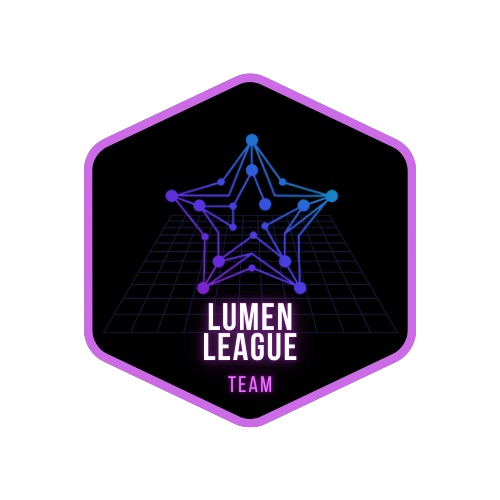

# Dojo Stellar - Lumen League Team

  

---

## 📌 **Índice**

1. [Sobre o Dojo Stellar](#🚀-sobre-o-dojo-stellar)
2. [Objetivos e Aprendizado](#🎯-objetivos-e-aprendizado)
3. [Participantes](#👥-participantes)
4. [Desafios Semanais](#🏆-desafios-semanais)
5. [Cronograma](#📅-cronograma)
6. [Licença](#📜-licença)

---

## 🚀 **Sobre o Dojo Stellar**

O <strong>Dojo Stellar</strong> é uma imersão prática organizada pela <strong>NearX</strong> (<a href="https://app.nearx.com.br" target="_blank">app.nearx.com.br</a>) para desenvolvedores que desejam dominar o ecossistema Stellar e se preparar para oportunidades emergentes na <strong>Web3</strong>.

A proposta do dojo é oferecer um ambiente dinâmico e colaborativo para que os participantes aprendam <strong>na prática</strong> a desenvolver aplicações descentralizadas utilizando a blockchain Stellar. Durante o evento, serão realizados desafios semanais que permitem aos desenvolvedores aprofundar seu conhecimento técnico, enriquecer seu portfólio e se destacar no mercado de blockchain e finanças descentralizadas (<strong>DeFi</strong>).

---

## 🎯 **Objetivos e Aprendizado**

O <strong>Dojo Stellar</strong> capacita os participantes para:

- **Compreender o ecossistema Stellar** e suas aplicações no mundo real.
- **Explorar oportunidades na Web3** e novas possibilidades de negócios para 2025.
- **Trabalhar com atualizações de código** da Stellar e contribuir ativamente para o ecossistema.
- **Desenvolver projetos práticos** que podem ser utilizados para aprimorar o portfólio profissional.

O evento é voltado tanto para desenvolvedores iniciantes quanto para aqueles que já possuem experiência em blockchain e desejam expandir seus conhecimentos em Stellar.

---

## 👥 **Participantes**

A equipe **Lumen League** é composta pelos seguintes membros:

  

    <a href="https://github.com/robdicoco" title="Perfil de Roberto Pavusa Junior no GitHub">
       
      <b>  robdicoco</b>
    </a>
  

  

    <a href="https://github.com/alfatektecnologia" title="Perfil de Emanoel de Oliveira no GitHub">
       
      <b>  alfatektecnologia</b>
    </a>
  

  

    <a href="https://github.com/lucenfort" title="Perfil de Luciano no GitHub">
       
      <b>  lucenfort</b>
    </a>
  

  

    <a href="https://github.com/uederson-ferreira" title="Perfil de Uederson Ferreira no GitHub">
       
      <b>  uederson-ferreira
    </a>
  

<!--
- [robdicoco](https://github.com/robdicoco)
- [alfatektecnologia](https://github.com/alfatektecnologia)
- [lucenfort](https://github.com/lucenfort)
- [uederson-ferreira](https://github.com/uederson-ferreira)
-->
---

## 🏆 **Desafios Semanais**

O <strong>Dojo Stellar</strong> é estruturado em quatro desafios progressivos, cada um focado no desenvolvimento de soluções para a rede Stellar.

---

### 📌 **Semana 1: Construção de um Explorador Blockchain**

  

📅 **Início:** 30/01  
📅 **Entrega:** 05/02  
🔗 [Detalhes do Desafio 1](docs/challenge1.md)

<strong>Objetivo:</strong> Criar um explorador blockchain que permita visualizar transações, contas e contratos inteligentes na Stellar.

---

### 📌 **Semana 2: Criação de uma Carteira CLI**

  

📅 **Início:** 05/02  
📅 **Entrega:** 12/02  

<strong>Objetivo:</strong> Desenvolver uma carteira de linha de comando (CLI) para realizar transações na Stellar de forma rápida e eficiente.

---

### 📌 **Semana 3: Implementação de um Oráculo Blockchain**

  

📅 **Início:** 12/02  
📅 **Entrega:** 19/02  

<strong>Objetivo:</strong> Criar um <strong>oráculo descentralizado</strong> para conectar a Stellar a fontes externas de dados confiáveis.

---

### 📌 **Semana 4: Desenvolvimento de uma Exchange Descentralizada (DEX)**

  

📅 **Início:** 19/02  
📅 **Entrega:** 03/05  

<strong>Objetivo:</strong> Construir uma <strong>exchange descentralizada</strong> (DEX) sobre a blockchain Stellar, permitindo a negociação de ativos digitais.

---

## 📅 **Cronograma**

| **Semana** | **Desafio** | **Descrição** | **Início** | **Entrega** | **Status** |
|:---------:|:------------:|:-------------:|:----------:|:-----------:|:----------:|
| 🟢 **Semana 1** | 🚀 **Explorador Blockchain** | Criar um explorador para visualizar transações, contas e contratos inteligentes na Stellar. | **30/01** | **05/02** | 🔄 *Em andamento* |
| 🟡 **Semana 2** | 💰 **Carteira CLI** | Desenvolver uma carteira CLI para transações na Stellar. | **05/02** | **12/02** | ⏳ *Aguardando início* |
| 🔵 **Semana 3** | 🔮 **Oráculo Blockchain** | Criar um **oráculo descentralizado** para conectar a Stellar a fontes externas de dados confiáveis. | **12/02** | **19/02** | ⏳ *Aguardando início* |
| 🟣 **Semana 4** | ⚡ **Exchange Descentralizada (DEX)** | Construir uma **DEX** para negociação de ativos digitais na Stellar. | **19/02** | **03/05** | ⏳ *Aguardando início* |

<!--
---
## 🤝 **Contribuição**

Se você deseja contribuir com o projeto, siga os passos abaixo:

1. **Faça um fork** do repositório.
2. Crie uma **branch** para sua feature (`git checkout -b feature/sua-feature`).
3. **Commit suas alterações** (`git commit -m "Descrição da mudança"`).
4. Faça um **push para a branch** (`git push origin feature/sua-feature`).
5. Abra um **Pull Request**.
-->

---

## 📜 **Licença**

Este projeto está licenciado sob a <strong>MIT License</strong>. Para mais detalhes, consulte o arquivo <a href="./LICENSE">LICENSE</a>.

---

📢 **Fique ligado!** Atualizações serão postadas conforme o progresso do **Dojo Stellar**. 🚀
