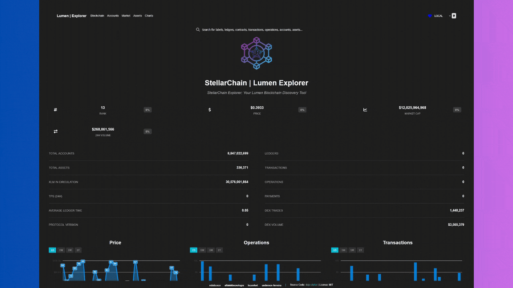

[← Back to README](../README-en.md)

# Dojo Stellar - Lumen League Team ✨

  

## 📜 Description

**Challenge #1** consists of creating a **Blockchain Explorer** for the Stellar network, allowing users to view transactions, accounts, and smart contracts. The project includes both setting up a Stellar node and developing an explorer that connects to it. This project is part of the **Dojo Stellar – Week 1** program.

  

---

## 🔥 Objectives
- **Create a Stellar Node** in any Cloud provider.
- **Develop an Explorer** that connects to the local Stellar node, which should:
  - 🔎 Look up a block by its number.
  - 🔍 Look up a transaction by its hash.
  - 💰 Look up an account balance by its address.

---

## ☁️ Solution: Stellar Node in the Cloud

  To set up a local Stellar node in the Cloud, we recommend following the guide below. This step-by-step tutorial will show you how to join the Stellar network, ensuring that your node is configured and ready for use.

  <a href="https://medium.com/@pavusa/create-your-local-stellar-node-a-step-by-step-guide-to-joining-the-stellar-network-179b80b26898" target="_blank">
    <strong>Create Your Local Stellar Node: A Step-by-Step Guide to Joining the Stellar Network!</strong>
  </a>

  

---

## 🚀 Solution: Explorer Connected to Local Stellar Node

This solution is divided into two parts: the **Backend (API)** and the **Frontend (User Interface)**.

### 🔧 Prerequisites

1. **Stellar SDK**  
   - **Backend:** Use the `stellar-sdk` package for Python.  
   - **Frontend:** Use the `stellar-sdk` package for JavaScript.
2. **FastAPI:** Framework for building the backend API.
3. **Vue.js:** JavaScript framework for creating the user interface.
4. **Node.js:** Required to run the Vue.js application.
5. **Python:** Required to run the FastAPI server.

---

### ⚙️ Backend (FastAPI)

#### Dependencies

- `fastapi`
- `uvicorn`
- `stellar-sdk`

The backend is responsible for:

- Connecting to the local Stellar node.
- Executing searches for blocks, transactions, and balances.
- Exposing the obtained information via API.

---

### 💻 Frontend (Vue.js)

#### Dependencies

- `axios` – for making calls to the backend API.

### 🏗️ Layout Structure

- **Header:** Includes the logo, navigation links, and icons for favorites, network selection, and settings.
- **Search Bar:** Input field for search with placeholder text.
- **Main Title and Subtitle:** Centered display of title and subtitle.
- **Statistics Cards:** Cards to display information such as ranking, price, market cap, and 24h volume.
- **Blockchain Data Section:** Two columns presenting various blockchain metrics.
- **Charts:** Display of historical data using a chart library.
- **Latest Ledgers:** Table or list displaying information of the most recent ledgers.

### 🔨 Component Implementation

#### **Header Component**

- Create a `<Header>` component containing the logo, navigation links, and icons for favorites, network selection, and settings.
- Use Vue Router for navigation links.

#### **Search Bar Component**

- Create a `<SearchBar>` component with an input field and a magnifying glass icon.
- Add a placeholder for search suggestions.

#### **Main Title and Subtitle Component**

- Display `"StellarChain | Explorer"` as the main title.
- Display `"StellarChain Explorer: Your Stellar Blockchain Explorer"` as the subtitle.

#### **Statistics Cards Component**

- Create a `<StatisticsCard>` component.
- Reuse the component multiple times to display different icons, titles, and values.
- Include a percentage variation indicator.

#### **Blockchain Data Section**

- Split into two columns using Flexbox or Grid.
- Populate each metric with simulated data.

#### **Charts Implementation**

- Choose a chart library, such as `VueChartjs`.
- Create specific components for each chart: Price, Operations, Transactions.
- Simulate data or fetch real information from an API.
- Include tabs for different time periods (1D, 1W, 1M, 1Y).

#### **Latest Ledgers Section**

- Use a table or list to display the data of recent ledgers.
- Simulate data or fetch information from an API.

---

## 📅 Timeline
- **Start:** 01/30/2025  
- **Delivery:** 02/05/2025  

---

## 🤝 Contribution
Contributions to the project are welcome! If you want to collaborate, follow these steps:  
1. **Fork** the repository.  
2. Create a **branch** for your feature or bug fix.  
3. Implement your changes.  
4. **Commit** and push to the repository.  
5. Open a **pull request**.  

---

## 📄 License
This project is licensed under the **MIT License**. See the [LICENSE](./LICENSE) file for details.

---

🌟 Developed during the <strong>Dojo Stellar</strong> program – <strong>Lumen League</strong> Team 🚀

