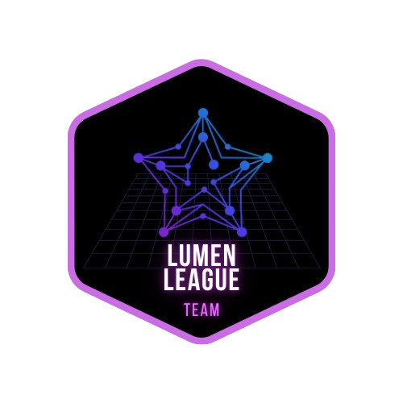

[← Voltar para o README](../README-en.md)

# Dojo Stellar - Lumen League Team ✨

  

## 🔥 Challenge 1

- **Deploy a Stellar Node** on any Cloud provider.

- **Develop an Explorer** that connects to the local Stellar node, which must:
  - 🔎 Search for a block by number.
  - 🔍 Search for a transaction by hash.
  - 💰 Retrieve an account balance by address.

## ☁️ Solution: Stellar Node on Cloud

  To set up a local Stellar node on the Cloud, we recommend following the guide below. This step-by-step tutorial will walk you through joining the Stellar network, ensuring your node is configured and ready to use.

  <a href="https://medium.com/@pavusa/create-your-local-stellar-node-a-step-by-step-guide-to-joining-the-stellar-network-179b80b26898" target="_blank">
    <strong>Create Your Local Stellar Node: A Step-by-Step Guide to Joining the Stellar Network!</strong>
  </a>

  

## 🚀 Solution: Explorer Connected to the Local Stellar Node

This solution consists of two parts: the **Backend (API)** and the **Frontend (User Interface)**.

### 🔧 Prerequisites

1. **Stellar SDK**  
   - **Backend:** Use the `stellar-sdk` package for Python.  
   - **Frontend:** Use the `stellar-sdk` package for JavaScript.
2. **FastAPI:** Framework for building the backend API.
3. **Vue.js:** JavaScript framework for frontend development.
4. **Node.js:** Required to run the Vue.js application.
5. **Python:** Required to run the FastAPI server.

---

### ⚙️ Backend (FastAPI)

#### Dependencies

- `fastapi`
- `uvicorn`
- `stellar-sdk`

The backend is responsible for:

- Connecting to the local Stellar node.
- Executing searches for blocks, transactions, and balances.
- Exposing retrieved data via an API.

---

### 💻 Frontend (Vue.js)

#### Dependencies

- `axios` – for making API requests to the backend.

### 🏗️ Layout Structure

- **Header:** Includes the logo, navigation links, and icons for favorites, network selection, and settings.
- **Search Bar:** Input field for searches with placeholder text.
- **Main Title and Subtitle:** Centralized display of the title and subtitle.
- **Statistics Cards:** Cards displaying ranking, price, market cap, and 24h volume.
- **Blockchain Data Section:** Two columns presenting various blockchain metrics.
- **Charts:** Displaying historical data using a charting library.
- **Latest Ledgers:** Table or list displaying recent ledger information.

### 🔨 Component Implementation

#### **Header Component**

- Create a `<Header>` component containing the logo, navigation links, and icons for favorites, network selection, and settings.
- Use Vue Router for navigation links.

#### **Search Bar Component**

- Create a `<SearchBar>` component with an input field and a search icon.
- Add placeholder text for search suggestions.

#### **Main Title and Subtitle Component**

- Display `"StellarChain | Explorer"` as the main title.
- Display `"StellarChain Explorer: Your Stellar Blockchain Discovery Tool"` as the subtitle.

#### **Statistics Cards Component**

- Create a `<StatisticsCard>` component.
- Reuse the component multiple times to display different icons, titles, and values.
- Include a percentage change indicator.

#### **Blockchain Data Section**

- Divide into two columns using Flexbox or Grid.
- Populate each metric with simulated data.

#### **Charts Implementation**

- Choose a charting library, such as `VueChartjs`.
- Create dedicated components for each chart: Price, Operations, Transactions.
- Simulate data or fetch real information from an API.
- Add tabs for different timeframes (1D, 1W, 1M, 1Y).

#### **Latest Ledgers Section**

- Use a table or list component to display recent ledger data.
- Simulate data or fetch information from an API.

### 🧩 Component Structure

- **App.vue:**  
  - Contains the main layout, including `<Header>`, `<SearchBar>`, `<MainTitle>`, `<StatisticsCards>`, `<BlockchainData>`, `<Charts>`, and `<LatestLedgers>` components.

- **Header.vue:**  
  - Includes the logo, navigation links, and icons.

- **SearchBar.vue:**  
  - Input field with placeholder text.

- **MainTitle.vue:**  
  - Displays the title and subtitle.

- **StatisticsCards.vue:**  
  - Multiple cards displaying ranking, price, market cap, and 24h volume.

- **BlockchainData.vue:**  
  - Two-column section presenting blockchain metrics.

- **Charts.vue:**  
  - Components for PriceChart, OperationsChart, and TransactionsChart.

- **LatestLedgers.vue:**  
  - Table or list displaying recent ledgers.
