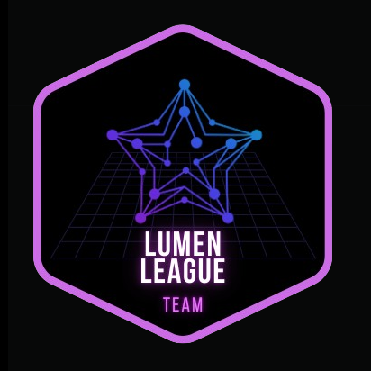

# Dojo Stellar - Lumen League team

## Challenge 1

-   Create Stellar node on any Cloud

-   Create an Explorer that connects to the local node of stellar, it
    must:
    -   Search for a block by number
    -   Search for a transaction by hash
    -   Search for the balance by address

## Solution: Stellar node on Cloud

<a href="https://medium.com/@pavusa/create-your-local-stellar-node-a-step-by-step-guide-to-joining-the-stellar-network-179b80b26898" target="_blank">Create Your Local Stellar Node: A Step-by-Step Guide to Joining the Stellar Network!
 
</a>

## Solution: Explorer that connects to the local node of stellar

### Prerequisites

1.  **Stellar SDK**: You'll need the Stellar SDK for Python (`stellar-sdk`) for the backend and JavaScript (`stellar-sdk`) for the frontend.
2.  **FastAPI**: For the backend API.
3.  **Vue.js**: For the frontend.
4.  **Node.js**: For running the Vue.js application.
5.  **Python**: For running the FastAPI server.

### Backend (FastAPI)

#### Dependencies

-   fastapi
-   uvicorn
-   stellar-sdk

### Frontend (Vue.js)

#### Dependencies

-   axios

#### Design of the layout:

-   **Header:** Include logo, navigation links, favorites/network selection/settings icons.
-   **Search Bar:** Implement a search input field with placeholder text.
-   **Main Title and Subtitle:** Display the title and subtitle centrally.
-   **Statistics Cards:** Create cards to show rank, price, market cap, and 24h volume.
-   **Blockchain Data Section:** Two columns for various blockchain metrics.
-   **Charts:** Use a charting library to display historical data.
-   **Latest Ledgers:** A table or list showing recent ledger information.

**The Header Component**

-   Create a `<Header>` component that includes the logo, navigation links, and icons for favorites, network selection, and settings.
-   Use Vue Router for navigation links.

**Search Bar Component**

-   Create a `<SearchBar>` component with an input field and a magnifying glass icon.
-   Add placeholder text for search suggestions.

**Main Title and Subtitle Components**

-   Display "StellarChain | Explorer" as the main title.
-   Add "StellarChain Explorer: Your Stellar Blockchain Discovery Tool" as the subtitle.

**Statistics Cards**

-   Create a `<StatisticsCard>` component.
-   Use it multiple times with different icons, titles, and values.
-   Include a percentage change indicator.

**Blockchain Data Section**

-   Divide it into two columns using Flexbox or Grid.
-   Populate each metric with simulated data.

**Implement Charts**

-   Choose a charting library, e.g., VueChartjs.
-   Create separate components for each chart: Price, Operations, Transactions.
-   Simulate data for the charts or fetch real data from an API.
-   Add tabs for different time periods (1D, 1W, 1M, 1Y).

**Create the Latest Ledgers Section**

-   Use a table or list component to display recent ledger data.
-   Simulate the data or fetch it from an API.

### Components structure:

-   **App.vue:**

    -   Contains the main layout, including `<Header>`, `<SearchBar>`, `<MainTitle>`, `<StatisticsCards>`, `<BlockchainData>`, `<Charts>`, and `<LatestLedgers>` components.

-   **Header.vue:**

    -   Includes logo, navigation links, and icons.

-   **SearchBar.vue:**

    -   Input field with placeholder text.

-   **MainTitle.vue:**

    -   Displays title and subtitle.

-   **StatisticsCards.vue:**

    -   Multiple cards for rank, price, market cap, and 24h volume.

-   **BlockchainData.vue:**

    -   Two columns for blockchain metrics.

-   **Charts.vue:**

    -   Components for PriceChart, OperationsChart, TransactionsChart.

-   **LatestLedgers.vue:**

    -   Table or list showing recent ledgers.
