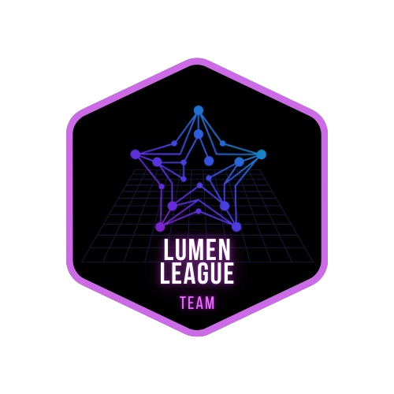

[← Voltar para o README](../README.md)

# Dojo Stellar - Equipe Lumen League ✨

  

## 🔥 Desafio 1

- **Criar um nó Stellar** em qualquer provedor de Cloud.

- **Desenvolver um Explorador** que se conecte ao nó local da Stellar, que deve:
  - 🔎 Buscar um bloco pelo número.
  - 🔍 Buscar uma transação pelo hash.
  - 💰 Buscar o saldo de uma conta pelo endereço.

## ☁️ Solução: Nó Stellar na Cloud

  Para configurar um nó Stellar local na Cloud, recomendamos seguir o guia abaixo. Este tutorial passo a passo mostrará como ingressar na rede Stellar, garantindo que seu nó esteja configurado e pronto para uso.

  <a href="https://medium.com/@pavusa/create-your-local-stellar-node-a-step-by-step-guide-to-joining-the-stellar-network-179b80b26898" target="_blank">
    <strong>Crie seu Nó Stellar Local: Um Guia Passo a Passo para Entrar na Rede Stellar!</strong>
  </a>

  

## 🚀 Solução: Explorador Conectado ao Nó Local da Stellar

Esta solução está dividida em duas partes: o **Backend (API)** e o **Frontend (Interface do Usuário)**.

### 🔧 Pré-requisitos

1. **Stellar SDK**  
   - **Backend:** Utilize o pacote `stellar-sdk` para Python.  
   - **Frontend:** Utilize o pacote `stellar-sdk` para JavaScript.
2. **FastAPI:** Framework para construir a API do backend.
3. **Vue.js:** Framework JavaScript para criação da interface do usuário.
4. **Node.js:** Necessário para executar a aplicação Vue.js.
5. **Python:** Necessário para rodar o servidor FastAPI.

---

### ⚙️ Backend (FastAPI)

#### Dependências

- `fastapi`
- `uvicorn`
- `stellar-sdk`

O backend é responsável por:

- Conectar-se ao nó local da Stellar.
- Executar buscas por blocos, transações e saldos.
- Expor as informações obtidas via API.

---

### 💻 Frontend (Vue.js)

#### Dependências

- `axios` – para realizar chamadas à API do backend.

### 🏗️ Estrutura do Layout:

- **Cabeçalho (Header):** Inclui o logotipo, links de navegação e ícones para favoritos, seleção de rede e configurações.
- **Barra de Pesquisa (Search Bar):** Campo de entrada para pesquisa com texto de placeholder.
- **Título Principal e Subtítulo:** Exibição centralizada do título e subtítulo.
- **Cartões de Estatísticas:** Cards para exibir informações como ranking, preço, capitalização de mercado e volume de 24h.
- **Seção de Dados da Blockchain:** Duas colunas apresentando métricas variadas da blockchain.
- **Gráficos:** Exibição de dados históricos usando uma biblioteca de gráficos.
- **Últimos Ledgers:** Tabela ou lista exibindo informações dos ledgers mais recentes.

### 🔨 Implementação dos Componentes:

#### **Componente Header**
- Criar um componente `<Header>` contendo o logotipo, links de navegação e ícones de favoritos, seleção de rede e configurações.
- Utilizar Vue Router para os links de navegação.

#### **Componente Search Bar**
- Criar um componente `<SearchBar>` com um campo de entrada e um ícone de lupa.
- Adicionar um placeholder para sugestões de pesquisa.

#### **Componente Main Title e Subtitle**
- Exibir `"StellarChain | Explorer"` como título principal.
- Exibir `"StellarChain Explorer: Seu Explorador da Blockchain Stellar"` como subtítulo.

#### **Componente Statistics Cards**
- Criar um componente `<StatisticsCard>`.
- Reutilizar o componente múltiplas vezes para exibir diferentes ícones, títulos e valores.
- Incluir um indicador de variação percentual.

#### **Seção de Dados da Blockchain**
- Dividir em duas colunas utilizando Flexbox ou Grid.
- Popular cada métrica com dados simulados.

#### **Implementação dos Gráficos**
- Escolher uma biblioteca de gráficos, como `VueChartjs`.
- Criar componentes específicos para cada gráfico: Preço, Operações, Transações.
- Simular dados ou buscar informações reais de uma API.
- Incluir abas para diferentes períodos de tempo (1D, 1S, 1M, 1A).

#### **Seção Últimos Ledgers**
- Utilizar uma tabela ou lista para exibir os dados dos ledgers recentes.
- Simular os dados ou buscar informações de uma API.

### 🧩 Estrutura dos Componentes:

- **App.vue:**  
    - Contém o layout principal, incluindo os componentes `<Header>`, `<SearchBar>`, `<MainTitle>`, `<StatisticsCards>`, `<BlockchainData>`, `<Charts>` e `<LatestLedgers>`.

- **Header.vue:**  
    - Inclui o logotipo, links de navegação e ícones.

- **SearchBar.vue:**  
    - Campo de entrada com placeholder.

- **MainTitle.vue:**  
    - Exibe o título e o subtítulo.

- **StatisticsCards.vue:**  
    - Cards para exibição de ranking, preço, capitalização de mercado e volume de 24h.

- **BlockchainData.vue:**  
    - Exibição de métricas da blockchain organizadas em duas colunas.

- **Charts.vue:**  
    - Componentes para exibição de gráficos: Preço, Operações e Transações.

- **LatestLedgers.vue:**  
    - Tabela ou lista para exibição dos ledgers mais recentes.
