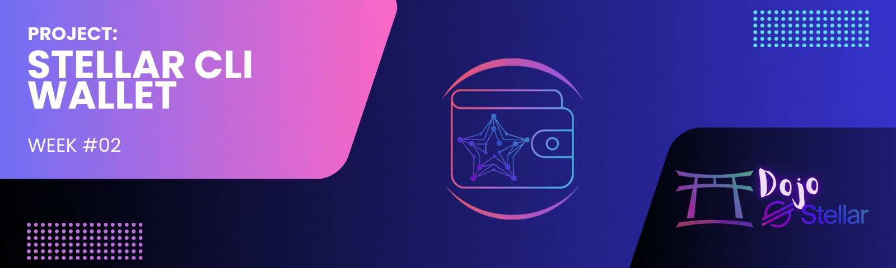

[](./challenge2-en.md)
[](./challenge2.md)

[← Back to README](../README-en.md)

# Dojo Stellar - Team Lumen League ✨

<p align="center">
  
</p>

[](#)


## 📜 Description
The **Lumen Stellar CLI Wallet** is a command-line interface (CLI) tool developed to facilitate interaction with the **Stellar blockchain** and the **Soroban RPC** service. It is ideal for developers and users who want to manage Stellar accounts, test smart contracts, or perform transactions in a simple and secure way. This project integrates essential features for managing wallets and transactions on the blockchain and is part of the **Dojo Stellar – Week 2** program.

[](https://crates.io/crates/stellar_cli_wallet_lumen)

## 🚀 Objective
Provide a robust and efficient command-line interface for:
- Generating public/private key pairs.
- Checking Stellar account balances.
- Performing secure transactions (sending XLM).
- Managing keystores for secure storage of private keys.
- Funding wallets on Testnet using Friendbot.

## ⚙️ Features
- **Key Generation**: Create public/private key pairs.  
- **Balance Inquiry**: Quickly check the balance of any Stellar account.  
- **XLM Transfer**: Secure transactions between Stellar accounts.  
- **Keystore Management**: Store and retrieve encrypted private keys.  
- **Account Funding**: Use Friendbot to add funds to test accounts.  
- **Environment Integration**: Support for configuring local RPC APIs.

## 📅 Timeline
- **Start:** 05/02/2025  
- **Delivery:** 12/02/2025  

---

## 🛠️ Technologies Used
- **Language:** Rust  
- **Blockchain:** Stellar  
- **RPC Service:** Soroban  

---

## 📦 Installation
To install the **Lumen Stellar CLI Wallet**, follow these steps:

1. Clone the repository:  
   ```bash
   git clone <repository_url>
   cd <repository_directory>
   ```

2. Build the project:  
   ```bash
   cargo build --release
   ```

3. Run the CLI:  
   ```bash
   ./target/release/stellar_wallet_cli
   ```

---

## 📚 Usage
After running the CLI, you can perform the following operations:

1. **Generate New Key Pair**  
   ```bash
   Generate New Keypair
   ```

2. **Check Balance**  
   ```bash
   Fetch Balance
   Enter Public Key: <public_key>
   ```

3. **Send XLM**  
   ```bash
   Send XLM
   Enter Source Secret Key: <source_secret_key>
   Enter Destination Public Key: <destination_public_key>
   Enter Amount: <amount>
   ```

4. **Save Keystore**  
   ```bash
   Save Keystore
   Enter Password: <password>
   ```

5. **Load Keystore**  
   ```bash
   Load Keystore
   Enter Password: <password>
   ```

6. **Fund Wallet (Testnet)**  
   ```bash
   Fund Wallet
   Enter Public Key to fund: <public_key>
   ```

7. **Exit**  
   ```bash
   Exit
   ```

---

## 🤝 Contribution
Contributions are welcome! If you want to contribute to this project, follow these steps:

1. **Fork** the repository.  
2. Create a **branch** for your feature or bug fix.  
3. Implement your changes.  
4. **Commit** and push your changes to the repository.  
5. Create a **pull request**.  

### Code Style
- Follow Rust idiomatic style guidelines.  
- Format the code using `cargo fmt` before submitting a PR.

---

## 📄 License
This project is licensed under the **MIT License**. See the [LICENSE](./LICENSE) file for details.

---

<p align="center">🌟 Developed during the <strong>Dojo Stellar</strong> program – <strong>Lumen League</strong> Team 🚀</p>
