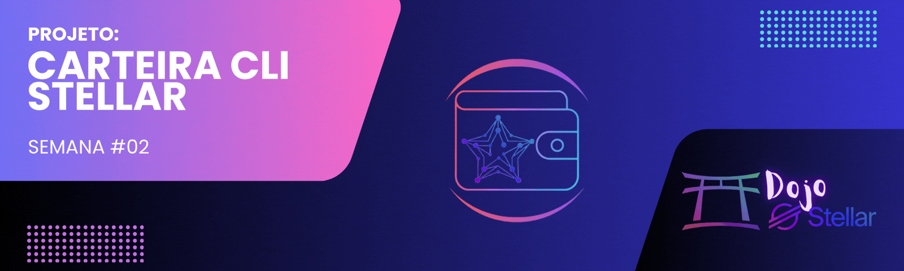

<!--

-->

[← Voltar para o README](../README.md)

# Dojo Stellar - Equipe Lumen League ✨ 

  

# Stellar CLI Wallet

## 📜 Descrição
Stellar CLI Wallet é uma aplicação de linha de comando (CLI) desenvolvida para facilitar a realização de transações na blockchain Stellar de forma rápida e eficiente. Este projeto faz parte do programa **Dojo Stellar** – Semana 2.

## 🚀 Objetivo
Desenvolver uma carteira CLI funcional que permita:
- Gerar e gerenciar chaves públicas e privadas
- Consultar saldos de contas na blockchain Stellar
- Enviar transações para outras contas
- Monitorar o status das transações

## 📅 Cronograma
- **Início:** 05/02/2025  
- **Entrega:** 12/02/2025  

## ⚙️ Funcionalidades
- Criar nova carteira com geração de chaves públicas e privadas.
- Recuperar uma carteira existente a partir de uma chave secreta.
- Verificar saldo da conta.
- Realizar transações simples.
- Consultar histórico de transações.

## 🛠️ Tecnologias Utilizadas
- **Linguagem:** Rust  
- **Blockchain:** Stellar  

---

🌟 Desenvolvido durante o programa <strong>Dojo Stellar</strong>

