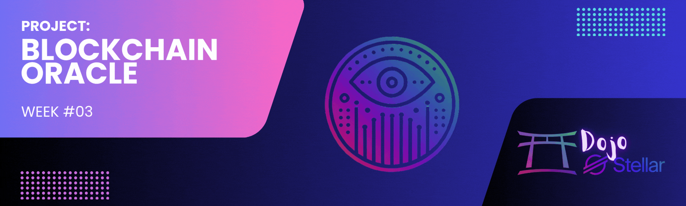

[](./challenge3.md)
[](./challenge3-en.md)

[← Back to README](../README-en.md)

# Dojo Stellar - Lumen League Team ✨

<p align="center">
  
</p>

[](#)


## 📜 Description
**Challenge #3** consists of developing a **Bitcoin/USD Price Oracle** integrated with the **Stellar** blockchain, using **Python** or **JavaScript**. The system must update the price every 12 hours and display the data in a front-end that consumes information directly from the Stellar blockchain. This project is part of the **Dojo Stellar – Week 3** program.

[](https://medium.com/@pavusa/building-a-stellar-oracle-a-step-by-step-guide-to-decentralized-data-feeds-dee992edd3ad)

---

## 📚 Introduction to Oracles

### What are Oracles?
Oracles are mechanisms that provide external data to blockchains. Since blockchains are closed and deterministic systems, they don't have direct access to real-world information, such as asset prices, weather conditions, or market events. Oracles solve this problem by connecting blockchains to external trusted data sources.

### Oracles for Blockchains
- **EVM (Ethereum Virtual Machine):** Chainlink, Band Protocol, API3, DIA  
- **Stellar:** Stellar doesn't have a native oracle system like Chainlink, but it allows users and external services to post data directly in transactions and contracts.

### Working Principle
The oracle collects data from a trusted source (e.g., Bitcoin price API), processes it, and publishes it on the blockchain so that other applications can consume this data in an immutable and verifiable way.

---

## 🚀 Objective
Develop a functional and efficient oracle that:
- **Queries and Updates the BTC/USD Price Every 12 Hours.**  
- **Displays Real-Time Information on the Front-End.**  
- **Fully Integrates with the Stellar Blockchain.**  

Additional suggested features:
- **TOP5 or TOP10 Cryptocurrencies Listing:** Allow the front-end to display the largest cryptocurrencies in the market besides BTC/USD.

---

## 📦 Development Instructions

### 1. Backend (Oracle)
- Develop the oracle to obtain the **Bitcoin/Dollar** price.  
- Update the price on the Stellar blockchain every 12 hours.  
- Use [Stellar SDK](https://developers.stellar.org/docs/tools/sdks/library) for interactions.  
- Store the price using the **MANAGE_DATA** operation in the Stellar account.

#### Example code in Python:
```python
transaction.append_manage_data_op(data_name="BTC_USD", data_value=str(price))
transaction.sign(keypair)
response = server.submit_transaction(transaction)
print("Transaction sent!", response)
```

### 2. Front-End
- Display the updated price directly from the blockchain.  
- Implement a simple and responsive interface.  
- Integrate with the oracle developed in the backend.  

Suggested additional features:  
- Display the TOP5 or TOP10 most relevant cryptocurrencies in the market.

### 3. Automatic Update Every 12 Hours
- Use **cron jobs** on Linux or the `schedule` module in Python to perform periodic updates.  

Example in Python:
```python
import schedule
import time

def update_price():
    print("Updating price...")
    # Function to query the API and send the transaction to the Stellar blockchain

schedule.every(12).hours.do(update_price)

while True:
    schedule.run_pending()
    time.sleep(60)
```

---

## 📚 How to Interact with the Stellar Network

### Main Operations on Stellar:
- **CREATE_ACCOUNT:** Creation of a new account.  
- **PAYMENT:** Transfer of assets between accounts.  
- **MANAGE_DATA:** Store or remove data associated with an account (fundamental for oracles).  
- **SET_OPTIONS:** Modify account settings, such as multiple signature limits.  
- **CHANGE_TRUST:** Create, modify, or remove a trust relationship with an issuer of custom assets.  

### Stellar Transaction Parameters:
- **Source Account:** Account that originates the transaction.  
- **Fee:** Network fee to process the transaction.  
- **Sequence Number:** Unique number to avoid transaction duplication.  
- **Operations:** Actions that the transaction performs (e.g., payment, data management).  
- **Signatures:** Cryptographic signatures to authorize the transaction.  
- **Memo (Optional):** Additional message included in the transaction.  

---

## 📅 Timeline
- **Start:** 02/12/2025  
- **Delivery:** 02/19/2025  

---

## 📚 Resources and Useful Links
- [Stellar SDK](https://developers.stellar.org/docs/tools/sdks/library)  
- [Oracle on the Stellar Blockchain (Support Document)](https://docs.google.com/document/d/10qQZiHMxY1t5VvRWtH3XALRP2Bj4Zu6ZSFqPolDU0iI/edit?usp=sharing)  
- [Stellar Account Viewer](https://accountviewer.stellar.org/)  
- Example of using **Managed Data Stellar**: [GitHub - otaviovin/managedatastellar](https://github.com/otaviovin/managedatastellar)  
- [Building a Stellar Oracle: A Step-by-Step Guide](https://medium.com/@pavusa/building-a-stellar-oracle-a-step-by-step-guide-to-decentralized-data-feeds-dee992edd3ad)

---

## 🤝 Contribution
Contributions to the project are welcome! If you want to collaborate, follow these steps:  
1. **Fork** the repository.  
2. Create a **branch** for your feature or bugfix.  
3. Implement your changes.  
4. **Commit** and push to the repository.  
5. Open a **pull request**.  

---

## 📄 License
This project is licensed under the **MIT License**. See the [LICENSE](./LICENSE) file for details.

---

<p align="center">🌟 Developed during the <strong>Dojo Stellar</strong> program – <strong>Lumen League</strong> Team 🚀</p> 