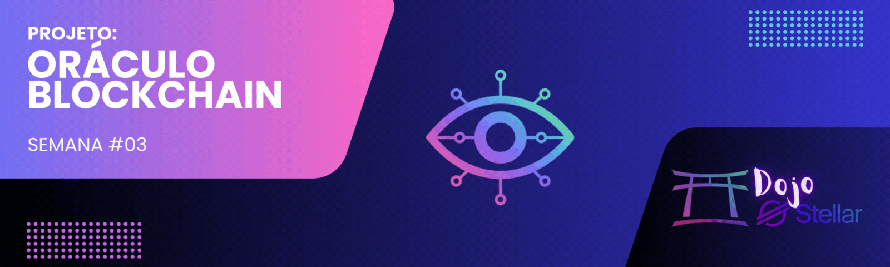

[](./challenge3.md)
[](./challenge3-en.md)

[← Voltar para o README](../README.md)

# Dojo Stellar - Equipe Lumen League ✨

<p align="center">
  
</p>

[](#)


## 📜 Descrição
O **Desafio #3** consiste em desenvolver um **Oráculo de Preço Bitcoin/Dólar** integrado à blockchain **Stellar**, utilizando **Python** ou **JavaScript**. O sistema deve atualizar o preço a cada 12 horas e exibir os dados em um front-end que consuma as informações diretamente da blockchain Stellar. Este projeto faz parte do programa **Dojo Stellar – Semana 3**.

[](https://medium.com/@pavusa/building-a-stellar-oracle-a-step-by-step-guide-to-decentralized-data-feeds-dee992edd3ad)

---

## 📚 Introdução aos Oráculos

### O que são Oráculos?
Oráculos são mecanismos que fornecem dados externos às blockchains. Como as blockchains são sistemas fechados e determinísticos, elas não têm acesso direto a informações do mundo real, como preços de ativos, condições climáticas ou eventos do mercado. Oráculos resolvem esse problema conectando as blockchains a fontes de dados externas.

### Oráculos para Blockchains
- **EVM (Ethereum Virtual Machine):** Chainlink, Band Protocol, API3, DIA  
- **Stellar:** A Stellar não possui um sistema nativo de oráculos como Chainlink, mas permite que usuários e serviços externos postem dados diretamente em transações e contratos.

### Princípio de Funcionamento
O oráculo coleta dados de uma fonte confiável (ex: API de preço do Bitcoin), processa e publica na blockchain para que outras aplicações possam consumir esses dados de forma imutável e verificável.

---

## 🚀 Objetivo
Desenvolver um oráculo funcional e eficiente que:
- **Consulta e Atualiza o Preço BTC/USD a Cada 12 Horas.**  
- **Exibe as Informações em Tempo Real no Front-End.**  
- **Integração Completa com a Blockchain Stellar.**  

Funcionalidades adicionais sugeridas:
- **Listagem TOP5 ou TOP10 Criptomoedas:** Permitir que o front-end exiba as maiores criptomoedas do mercado além de BTC/USD.

---

## 📦 Instruções de Desenvolvimento

### 1. Backend (Oráculo)
- Desenvolver o oráculo para obter o preço de **Bitcoin/Dólar**.  
- Atualizar o preço na blockchain Stellar a cada 12 horas.  
- Utilizar [Stellar SDK](https://developers.stellar.org/docs/tools/sdks/library) para interações.  
- Armazenar o preço usando a operação **MANAGE_DATA** na conta Stellar.

#### Exemplo de código em Python:
```python
transaction.append_manage_data_op(data_name="BTC_USD", data_value=str(price))
transaction.sign(keypair)
response = server.submit_transaction(transaction)
print("Transação enviada!", response)
```

### 2. Front-End
- Exibir o preço atualizado diretamente da blockchain.  
- Implementar uma interface simples e responsiva.  
- Integrar com o oráculo desenvolvido no backend.  

Sugestão de funcionalidades adicionais:  
- Exibir a listagem TOP5 ou TOP10 criptomoedas mais relevantes do mercado.

### 3. Atualização Automática a Cada 12 Horas
- Utilizar **cron jobs** no Linux ou o módulo `schedule` em Python para executar atualizações periódicas.  

Exemplo em Python:
```python
import schedule
import time

def update_price():
    print("Atualizando preço...")
    # Função para consultar a API e enviar a transação à blockchain Stellar

schedule.every(12).hours.do(update_price)

while True:
    schedule.run_pending()
    time.sleep(60)
```

---

## 📚 Como Interagir com a Rede Stellar

### Principais Operações na Stellar:
- **CREATE_ACCOUNT:** Criação de uma nova conta.  
- **PAYMENT:** Transferência de ativos entre contas.  
- **MANAGE_DATA:** Armazenar ou remover dados associados a uma conta (fundamental para oráculos).  
- **SET_OPTIONS:** Modificar configurações da conta, como limites de assinaturas múltiplas.  
- **CHANGE_TRUST:** Criar, modificar ou remover uma relação de confiança com um emissor de ativos personalizados.  

### Parâmetros das Transações Stellar:
- **Source Account:** Conta que origina a transação.  
- **Fee:** Taxa de rede para processar a transação.  
- **Sequence Number:** Número único para evitar duplicação de transações.  
- **Operations:** Ações que a transação executa (ex: pagamento, gerenciamento de dados).  
- **Signatures:** Assinaturas criptográficas para autorizar a transação.  
- **Memo (Opcional):** Mensagem adicional incluída na transação.  

---

## 📅 Cronograma
- **Início:** 12/02/2025  
- **Entrega:** 19/02/2025  

---

## 📚 Recursos e Links Úteis
- [Stellar SDK](https://developers.stellar.org/docs/tools/sdks/library)  
- [Oráculo na Stellar Blockchain (Documento de Apoio)](https://docs.google.com/document/d/10qQZiHMxY1t5VvRWtH3XALRP2Bj4Zu6ZSFqPolDU0iI/edit?usp=sharing)  
- [Stellar Account Viewer](https://accountviewer.stellar.org/)  
- Exemplo de uso de **Managed Data Stellar**: [GitHub - otaviovin/managedatastellar](https://github.com/otaviovin/managedatastellar)  

---

## 🤝 Contribuição
Contribuições para o projeto são bem-vindas! Se deseja colaborar, siga estas etapas:  
1. Faça um **fork** do repositório.  
2. Crie uma **branch** para sua feature ou correção de bug.  
3. Implemente suas mudanças.  
4. **Commit** e envie para o repositório.  
5. Abra um **pull request**.  

---

## 📄 Licença
Este projeto está licenciado sob a **MIT License**. Consulte o arquivo [LICENSE](./LICENSE) para mais detalhes.

---

<p align="center">🌟 Desenvolvido durante o programa <strong>Dojo Stellar</strong> – Equipe <strong>Lumen League</strong> 🚀</p>
