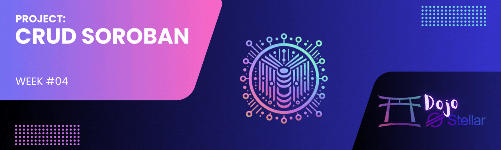

[](./challenge4.md)
[](./challenge4-en.md)

[← Back to README](../README-en.md)

# Dojo Stellar - Lumen League Team ✨

<p align="center">
  
</p>

[](#)


## 📜 Description
**Challenge #4** consists of developing a **CRUD (Create, Read, Update, Delete)** system using **Soroban**, Stellar's smart contract platform. In this project, we implemented a simple book registry that allows adding, viewing, updating, and deleting book information directly on the blockchain. This project is part of the **Dojo Stellar – Week 4** program.

[](https://github.com/lucenfort/dojo-stellar/tree/main/src/backend/soroban-crud)

---

## 🚀 Objective
Develop a complete smart contract on Soroban that:
- **Implements all CRUD operations** for book registration.
- **Stores and manages** data with the following attributes:
  - Book Title
  - Book Author
  - Publication Year
- **Demonstrates the practical application** of smart contracts on the Stellar blockchain.

---

## 🛠️ Technologies Used
- **Language:** Rust
- **Framework:** Soroban SDK
- **Blockchain:** Stellar
- **Development Environment:** Soroban CLI

---

## 📦 Project Structure

```
soroban-crud/
├── contracts/
│   └── book/
│       ├── src/
│       │   ├── lib.rs         # Main contract implementation
│       │   └── test.rs        # Contract tests
│       └── Cargo.toml         # Contract dependencies
├── Cargo.toml                  # Workspace configuration
└── README.md                   # Documentation
```

---

## 💻 Contract Implementation

### Data Structure
The contract uses the following structure to represent a book:

```rust
#[derive(Clone, Debug, Eq, PartialEq, Deserialize, Serialize)]
pub struct Book {
    pub title: String,
    pub author: String,
    pub year: u32,
}
```

### Main Features
The contract implements the following operations:

1. **Create:** Adds a new book to the registry.
2. **Read:** Retrieves book information by its ID.
3. **Update:** Modifies information of an existing book.
4. **Delete:** Removes a book from the registry.
5. **List:** Gets the list of all registered books.

### Contract Interface Example

```rust
pub trait BookRegistryTrait {
    // Create a new book
    fn create_book(env: Env, title: String, author: String, year: u32) -> u32;
    
    // Read book information
    fn read_book(env: Env, id: u32) -> Option<Book>;
    
    // Update book information
    fn update_book(env: Env, id: u32, title: String, author: String, year: u32) -> bool;
    
    // Delete a book
    fn delete_book(env: Env, id: u32) -> bool;
    
    // List all books
    fn list_books(env: Env) -> Vec<(u32, Book)>;
}
```

---

## 🧪 Testing and Verification

The contract includes comprehensive tests to verify all functionalities:

- **Creation Tests:** Verify that new books are added correctly.
- **Reading Tests:** Confirm the accurate retrieval of book information.
- **Update Tests:** Ensure that modifications are applied correctly.
- **Deletion Tests:** Verify the proper removal of books.
- **Listing Tests:** Ensure that all books are listed correctly.

---

## 📋 How to Use the Contract

### Prerequisites
- Soroban CLI installed
- Rust and Cargo configured
- Connection to the Stellar network (Testnet or Futurenet)

### Contract Compilation
```bash
cd soroban-crud
cargo build --release
```

### Contract Deployment
```bash
soroban contract deploy \
  --wasm target/wasm32-unknown-unknown/release/book_registry.wasm \
  --source <your-secret-key> \
  --rpc-url https://soroban-testnet.stellar.org \
  --network-passphrase 'Test SDF Network ; September 2015'
```

### Interacting with the Contract
```bash
# Create a book
soroban contract invoke \
  --id <contract-id> \
  --source <your-secret-key> \
  --rpc-url https://soroban-testnet.stellar.org \
  --network-passphrase 'Test SDF Network ; September 2015' \
  -- create_book \
  --title "Don Quixote" \
  --author "Miguel de Cervantes" \
  --year 1605

# Read book information
soroban contract invoke \
  --id <contract-id> \
  --source <your-secret-key> \
  --rpc-url https://soroban-testnet.stellar.org \
  --network-passphrase 'Test SDF Network ; September 2015' \
  -- read_book \
  --id 1
```

---

## 📅 Timeline
- **Start:** 02/19/2025  
- **Delivery:** 03/05/2025  

---

## 📚 Resources and Useful Links
- [Soroban Documentation](https://developers.stellar.org/docs/smart-contracts/getting-started/hello-world)
- [Rust and Soroban SDK](https://developers.stellar.org/docs/tools/sdks/library)
- [Stellar Bootcamp - CRUD Example](https://github.com/nrxschool/stellar-bootcamp/tree/main/aula03)
- [Video Tutorial: Advancing in Soroban and SDK](https://www.youtube.com/watch?v=0iFOg-s-3G8)

---

## 🤝 Contribution
Contributions to the project are welcome! If you want to collaborate, follow these steps:  
1. **Fork** the repository.  
2. Create a **branch** for your feature or bugfix.  
3. Implement your changes.  
4. **Commit** and push to the repository.  
5. Open a **pull request**.  

---

## 📄 License
This project is licensed under the **MIT License**. See the [LICENSE](./LICENSE) file for details.

---

<p align="center">🌟 Developed during the <strong>Dojo Stellar</strong> program – <strong>Lumen League</strong> Team 🚀</p> 