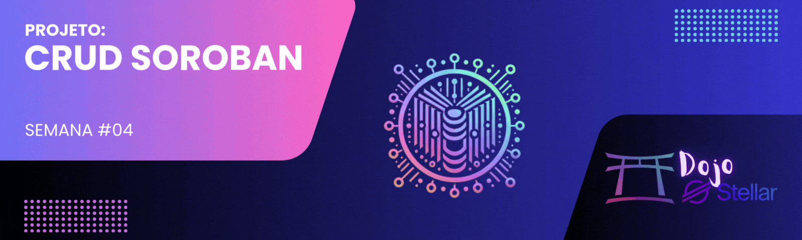

[](./challenge4.md)
[](./challenge4-en.md)

[← Voltar para o README](../README.md)

# Dojo Stellar - Equipe Lumen League ✨

<p align="center">
  
</p>

[](#)


## 📜 Descrição
O **Desafio #4** consiste em desenvolver um **CRUD (Create, Read, Update, Delete)** utilizando o **Soroban**, o sistema de contratos inteligentes da Stellar. Neste projeto, implementamos um registro simples de livros que permite adicionar, visualizar, atualizar e excluir informações sobre livros diretamente na blockchain. Este projeto faz parte do programa **Dojo Stellar – Semana 4**.

[](https://github.com/lucenfort/dojo-stellar/tree/main/src/backend/soroban-crud)

---

## 🚀 Objetivo
Desenvolver um contrato inteligente completo no Soroban que:
- **Implementa todas as operações CRUD** para registro de livros.
- **Armazena e gerencia** dados com os seguintes atributos:
  - Título do Livro
  - Autor do Livro
  - Ano de Publicação
- **Demonstra a aplicação prática** de contratos inteligentes na blockchain Stellar.

---

## 🛠️ Tecnologias Utilizadas
- **Linguagem:** Rust
- **Framework:** Soroban SDK
- **Blockchain:** Stellar
- **Ambiente de Desenvolvimento:** Soroban CLI

---

## 📦 Estrutura do Projeto

```
soroban-crud/
├── contracts/
│   └── book/
│       ├── src/
│       │   ├── lib.rs         # Implementação principal do contrato
│       │   └── test.rs        # Testes do contrato
│       └── Cargo.toml         # Dependências do contrato
├── Cargo.toml                  # Configuração do workspace
└── README.md                   # Documentação
```

---

## 💻 Implementação do Contrato

### Estrutura de Dados
O contrato utiliza a seguinte estrutura para representar um livro:

```rust
#[derive(Clone, Debug, Eq, PartialEq, Deserialize, Serialize)]
pub struct Book {
    pub title: String,
    pub author: String,
    pub year: u32,
}
```

### Principais Funcionalidades
O contrato implementa as seguintes operações:

1. **Criar (Create):** Adiciona um novo livro ao registro.
2. **Ler (Read):** Recupera informações de um livro pelo seu ID.
3. **Atualizar (Update):** Modifica informações de um livro existente.
4. **Excluir (Delete):** Remove um livro do registro.
5. **Listar (List):** Obtém a lista de todos os livros registrados.

### Exemplo de Interface do Contrato

```rust
pub trait BookRegistryTrait {
    // Criar um novo livro
    fn create_book(env: Env, title: String, author: String, year: u32) -> u32;
    
    // Ler informações de um livro
    fn read_book(env: Env, id: u32) -> Option<Book>;
    
    // Atualizar informações de um livro
    fn update_book(env: Env, id: u32, title: String, author: String, year: u32) -> bool;
    
    // Excluir um livro
    fn delete_book(env: Env, id: u32) -> bool;
    
    // Listar todos os livros
    fn list_books(env: Env) -> Vec<(u32, Book)>;
}
```

---

## 🧪 Testes e Verificação

O contrato inclui testes abrangentes para verificar todas as funcionalidades:

- **Testes de Criação:** Verificam se novos livros são adicionados corretamente.
- **Testes de Leitura:** Confirmam a recuperação precisa de informações de livros.
- **Testes de Atualização:** Garantem que as modificações são aplicadas corretamente.
- **Testes de Exclusão:** Verificam a remoção adequada de livros.
- **Testes de Listagem:** Asseguram que todos os livros são listados corretamente.

---

## 📋 Como Usar o Contrato

### Pré-requisitos
- Soroban CLI instalado
- Rust e Cargo configurados
- Conexão com a rede Stellar (Testnet ou Futurenet)

### Compilação do Contrato
```bash
cd soroban-crud
cargo build --release
```

### Implantação do Contrato
```bash
soroban contract deploy \
  --wasm target/wasm32-unknown-unknown/release/book_registry.wasm \
  --source <sua-chave-secreta> \
  --rpc-url https://soroban-testnet.stellar.org \
  --network-passphrase 'Test SDF Network ; September 2015'
```

### Interação com o Contrato
```bash
# Criar um livro
soroban contract invoke \
  --id <contract-id> \
  --source <sua-chave-secreta> \
  --rpc-url https://soroban-testnet.stellar.org \
  --network-passphrase 'Test SDF Network ; September 2015' \
  -- create_book \
  --title "Dom Casmurro" \
  --author "Machado de Assis" \
  --year 1899

# Ler informações de um livro
soroban contract invoke \
  --id <contract-id> \
  --source <sua-chave-secreta> \
  --rpc-url https://soroban-testnet.stellar.org \
  --network-passphrase 'Test SDF Network ; September 2015' \
  -- read_book \
  --id 1
```

---

## 📅 Cronograma
- **Início:** 19/02/2025  
- **Entrega:** 05/03/2025  

---

## 📚 Recursos e Links Úteis
- [Documentação do Soroban](https://developers.stellar.org/docs/smart-contracts/getting-started/hello-world)
- [Rust e Soroban SDK](https://developers.stellar.org/docs/tools/sdks/library)
- [Bootcamp Stellar - Exemplo de CRUD](https://github.com/nrxschool/stellar-bootcamp/tree/main/aula03)
- [Vídeo Tutorial: Avançando em Soroban e SDK](https://www.youtube.com/watch?v=0iFOg-s-3G8)

---

## 🤝 Contribuição
Contribuições para o projeto são bem-vindas! Se deseja colaborar, siga estas etapas:  
1. Faça um **fork** do repositório.  
2. Crie uma **branch** para sua feature ou correção de bug.  
3. Implemente suas mudanças.  
4. **Commit** e envie para o repositório.  
5. Abra um **pull request**.  

---

## 📄 Licença
Este projeto está licenciado sob a **MIT License**. Consulte o arquivo [LICENSE](./LICENSE) para mais detalhes.

---

<p align="center">🌟 Desenvolvido durante o programa <strong>Dojo Stellar</strong> – Equipe <strong>Lumen League</strong> 🚀</p>
