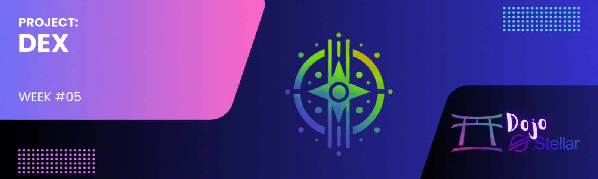

[](./challenge5.md)
[](./challenge5-en.md)

[← Back to README](../README-en.md)

# Dojo Stellar - Lumen League Team ✨

<p align="center">
  
</p>

[](#)


## 📜 Description
**Challenge #5** consists of developing a **Decentralized Exchange (DEX)** on the **Stellar** blockchain. This DEX will allow users to trade digital assets in a decentralized, secure, and efficient manner, without intermediaries. This project is part of the **Dojo Stellar – Week 5** program.

[](https://github.com/lucenfort/dojo-stellar/tree/main/src/backend/stellar-dex)

---

## 🚀 Objective
Develop a complete decentralized exchange on Stellar that:
- **Enables listing and trading** of different asset pairs.
- **Implements market functionalities** such as limit orders and market orders.
- **Provides an intuitive interface** to facilitate trading operations.
- **Ensures transaction security** through Stellar blockchain technology.
- **Demonstrates practical application** of DeFi in the Stellar ecosystem.

---

## 🛠️ Technologies Used
- **Blockchain:** Stellar
- **Smart Contracts:** Soroban (optional)
- **Front-end:** React/Vue/Angular
- **Back-end:** Node.js
- **APIs:** Stellar SDK, Horizon API
- **Authentication:** Stellar Web Authentication
- **Storage:** IPFS (optional)

---

## 📦 Project Structure

```
stellar-dex/
├── frontend/               # DEX user interface
│   ├── public/             # Static files
│   ├── src/                # Frontend source code
│   │   ├── components/     # React/Vue components
│   │   ├── pages/          # Application pages
│   │   ├── services/       # Stellar connection services
│   │   └── utils/          # Utilities
│   └── package.json        # Frontend dependencies
├── backend/                # Backend services (if needed)
│   ├── src/                # Backend source code
│   │   ├── api/            # API routes
│   │   ├── services/       # Business services
│   │   └── utils/          # Utilities
│   └── package.json        # Backend dependencies
├── contracts/              # Smart contracts (if using Soroban)
│   └── src/                # Contract source code
└── README.md               # Documentation
```

---

## 💻 Main Features

### Essential Resources
1. **Wallet Management:**
   - Connection with Stellar wallets (Albedo, Freighter, etc.)
   - Balance and transaction history viewing

2. **Order Book:**
   - Buy and sell order visualization
   - Implementation of price and volume charts

3. **Trading:**
   - Creation of limit orders and market orders
   - Cancellation and modification of existing orders

4. **Asset Management:**
   - Listing of assets available for trading
   - Addition of new assets to the wallet (trustlines)

### Advanced Features (optional)
- **Automated Liquidity:** Implementation of AMM (Automated Market Maker)
- **Market Analysis:** Technical analysis tools
- **Governance:** Voting system for platform decision-making

---

## 🧪 Testing and Security

### Testing Strategy
- **Unit Tests:** For critical trading functions and financial calculations
- **Integration Tests:** To ensure correct interaction with the Stellar blockchain
- **Interface Tests:** To validate user experience
- **Security Tests:** Security audits to identify vulnerabilities

### Security Measures
- **Transaction Validation:** Rigorous verification before signing
- **Attack Protection:** Implementation of rate limiting and DDoS protections
- **Monitoring:** Alert system for suspicious activities

---

## 📋 Implementation Guide

### Phase 1: Setup and Planning
- Define detailed scope and architecture
- Configure development environment
- Prepare repository and project structure

### Phase 2: Core Development
- Implement connection to the Stellar Network
- Develop basic trading functions
- Create main user interface

### Phase 3: Enhancement and Testing
- Add advanced features
- Perform comprehensive testing
- Optimize performance and security

### Phase 4: Launch and Documentation
- Prepare complete documentation
- Deploy to production environment
- Collect initial feedback and make adjustments

---

## 📅 Timeline
- **Start:** 03/05/2023  
- **Delivery:** Open-ended

---

## 📚 Resources and Useful Links
- [Stellar Official Documentation](https://developers.stellar.org/docs)
- [Stellar Laboratory](https://laboratory.stellar.org/)
- [Stellar SDK for JavaScript](https://github.com/stellar/js-stellar-sdk)
- [DEX Best Practices Guide](https://developers.stellar.org/docs/tutorials/dex-trading)
- [Stellar Pathfinding Tutorial](https://www.stellar.org/developers-blog/path-finding-on-stellar-basics)
- [Stellar DEX Compliance](https://developers.stellar.org/docs/anchoring-assets/compliance-protocol/compliance-protocol)

---

## 🤝 Contribution
Contributions to the project are welcome! If you want to collaborate, follow these steps:  
1. **Fork** the repository.  
2. Create a **branch** for your feature or bugfix.  
3. Implement your changes.  
4. **Commit** and push to the repository.  
5. Open a **pull request**.  

---

## 📄 License
This project is licensed under the **MIT License**. See the [LICENSE](./LICENSE) file for details.

---

<p align="center">🌟 Developed during the <strong>Dojo Stellar</strong> program – <strong>Lumen League</strong> Team 🚀</p>
