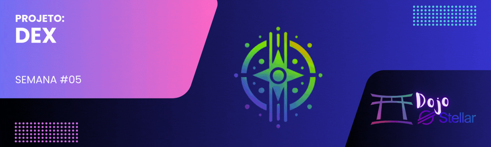

[](./challenge5.md)
[](./challenge5-en.md)

[← Voltar para o README](../README.md)

# Dojo Stellar - Equipe Lumen League ✨

<p align="center">
  
</p>

[](#)


## 📜 Descrição
O **Desafio #5** consiste em desenvolver uma **Exchange Descentralizada (DEX)** na blockchain **Stellar**. Esta DEX permitirá que os usuários negociem ativos digitais de forma descentralizada, segura e eficiente, sem intermediários. Este projeto faz parte do programa **Dojo Stellar – Semana 5**.

[](https://github.com/lucenfort/dojo-stellar/tree/main/src/backend/stellar-dex)

---

## 🚀 Objetivo
Desenvolver uma exchange descentralizada completa na Stellar que:
- **Permite a listagem e negociação** de diferentes pares de ativos.
- **Implementa funcionalidades de mercado** como ordens limitadas e ordens de mercado.
- **Oferece interface intuitiva** para facilitar as operações de trading.
- **Garante a segurança das transações** através da tecnologia blockchain Stellar.
- **Demonstra a aplicação prática** de DeFi no ecossistema Stellar.

---

## 🛠️ Tecnologias Utilizadas
- **Blockchain:** Stellar
- **Smart Contracts:** Soroban (opcional)
- **Front-end:** React/Vue/Angular
- **Back-end:** Node.js
- **APIs:** Stellar SDK, Horizon API
- **Autenticação:** Stellar Web Authentication
- **Armazenamento:** IPFS (opcional)

---

## 📦 Estrutura do Projeto

```
stellar-dex/
├── frontend/               # Interface do usuário da DEX
│   ├── public/             # Arquivos estáticos
│   ├── src/                # Código fonte do frontend
│   │   ├── components/     # Componentes React/Vue
│   │   ├── pages/          # Páginas da aplicação
│   │   ├── services/       # Serviços de conexão com a Stellar
│   │   └── utils/          # Utilitários
│   └── package.json        # Dependências do frontend
├── backend/                # Serviços de backend (se necessário)
│   ├── src/                # Código fonte do backend
│   │   ├── api/            # Rotas da API
│   │   ├── services/       # Serviços de negócios
│   │   └── utils/          # Utilitários
│   └── package.json        # Dependências do backend
├── contracts/              # Contratos inteligentes (se usar Soroban)
│   └── src/                # Código fonte dos contratos
└── README.md               # Documentação
```

---

## 💻 Funcionalidades Principais

### Recursos Essenciais
1. **Gerenciamento de Carteira:**
   - Conexão com carteiras Stellar (Albedo, Freighter, etc.)
   - Visualização de saldos e histórico de transações

2. **Livro de Ofertas:**
   - Visualização de ordens de compra e venda
   - Implementação de gráficos de preços e volume

3. **Negociação:**
   - Criação de ordens limitadas e ordens de mercado
   - Cancelamento e modificação de ordens existentes

4. **Gerenciamento de Ativos:**
   - Listagem de ativos disponíveis para negociação
   - Adição de novos ativos à carteira (trustlines)

### Características Avançadas (opcionais)
- **Liquidez Automatizada:** Implementação de AMM (Automated Market Maker)
- **Análise de Mercado:** Ferramentas de análise técnica
- **Governança:** Sistema de votação para tomada de decisões na plataforma

---

## 🧪 Testes e Segurança

### Estratégia de Testes
- **Testes Unitários:** Para funções críticas de negociação e cálculos financeiros
- **Testes de Integração:** Para garantir interação correta com a blockchain Stellar
- **Testes de Interface:** Para validar a experiência do usuário
- **Testes de Segurança:** Auditorias de segurança para identificar vulnerabilidades

### Medidas de Segurança
- **Validação de Transações:** Verificação rigorosa antes da assinatura
- **Proteção Contra Ataques:** Implementação de rate limiting e proteções contra DDoS
- **Monitoramento:** Sistema de alertas para atividades suspeitas

---

## 📋 Guia de Implementação

### Fase 1: Configuração e Planejamento
- Definir escopo detalhado e arquitetura
- Configurar ambiente de desenvolvimento
- Preparar repositório e estrutura do projeto

### Fase 2: Desenvolvimento Core
- Implementar conexão com a Stellar Network
- Desenvolver funções básicas de negociação
- Criar interface de usuário principal

### Fase 3: Aprimoramento e Testes
- Adicionar recursos avançados
- Realizar testes abrangentes
- Otimizar desempenho e segurança

### Fase 4: Lançamento e Documentação
- Preparar documentação completa
- Implantar em ambiente de produção
- Coletar feedback inicial e fazer ajustes

---

## 📅 Cronograma
- **Início:** 05/03/2023  
- **Entrega:** Em aberto

---

## 📚 Recursos e Links Úteis
- [Documentação Oficial da Stellar](https://developers.stellar.org/docs)
- [Stellar Laboratory](https://laboratory.stellar.org/)
- [Stellar SDK para JavaScript](https://github.com/stellar/js-stellar-sdk)
- [Guia de Melhores Práticas para DEX](https://developers.stellar.org/docs/tutorials/dex-trading)
- [Tutorial sobre Pathfinding na Stellar](https://www.stellar.org/developers-blog/path-finding-on-stellar-basics)
- [Stellar DEX Compliance](https://developers.stellar.org/docs/anchoring-assets/compliance-protocol/compliance-protocol)

---

## 🤝 Contribuição
Contribuições para o projeto são bem-vindas! Se deseja colaborar, siga estas etapas:  
1. Faça um **fork** do repositório.  
2. Crie uma **branch** para sua feature ou correção de bug.  
3. Implemente suas mudanças.  
4. **Commit** e envie para o repositório.  
5. Abra um **pull request**.  

---

## 📄 Licença
Este projeto está licenciado sob a **MIT License**. Consulte o arquivo [LICENSE](./LICENSE) para mais detalhes.

---

<p align="center">🌟 Desenvolvido durante o programa <strong>Dojo Stellar</strong> – Equipe <strong>Lumen League</strong> 🚀</p>
